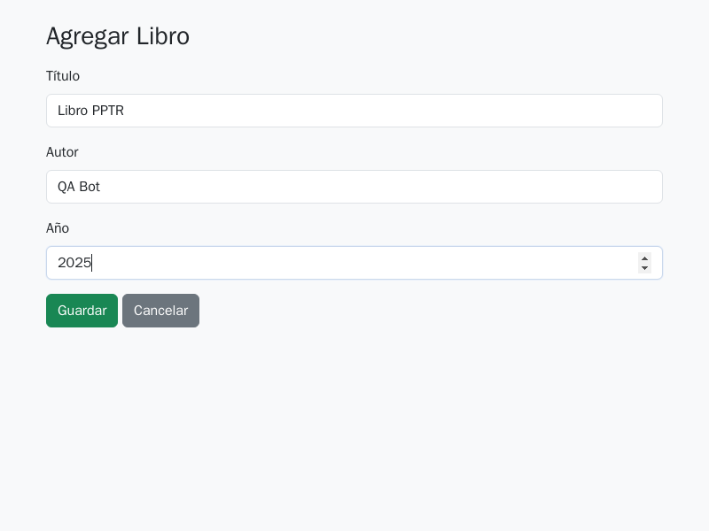

# Estructura

El `docker-compose.yml` coordina cuatro contenedores que forman el proyecto:

##  mongodb

* **Construido desde ./mongo**
* Usa variables desde mongo/.env
* Expone el puerto 27017
* Monta el directorio mongo/init/ para insertar automáticamente los 5 libros al iniciar
* Guarda datos en un volumen persistente mongo_data

## api

* **Construido desde ./api**
* Depende de MongoDB (se inicia después)
* Expone la API REST CRUD en localhost:3000
* Utiliza sus propias variables definidas en api/.env

##  frontend

* **Construido desde ./frontend**
* Interactúa con el backend
* Expone páginas HTML simples en el puerto 8080

## puppeteer

* **Construido desde ./puppeteer-tests**
* Ejecutará las pruebas automatizadas usando Puppeteer
* Depende del frontend (debe estar levantado para navegar a las páginas)
* Redes y Volúmenes
* mongo_data mantiene los datos de MongoDB aunque el contenedor se reinicie.
* app_net permite que todos los servicios se comuniquen entre sí.


# Referencias

https://pptr.dev/


# Prueba dentro del contenedor:

```bash
docker compose up --build -d 
```

##  Entrar al contenedor `pptr_container` usando:
```bash
docker exec -it pptr_container sh
```

## instalar las dependencias dentro de package.json
```bash
npm install
```

# Ejecutar prueba

Recordar que es la entrada declarada en package.json
```bash
npm run e2e
```

Podrá ver los archivos


### Index de la página


### Página insertando un libro



### Index de la página mostrando libro insertado


# Para la ejecución en la máquina local usar:

<a href='./local'> Ejecución sin contenedor </a>